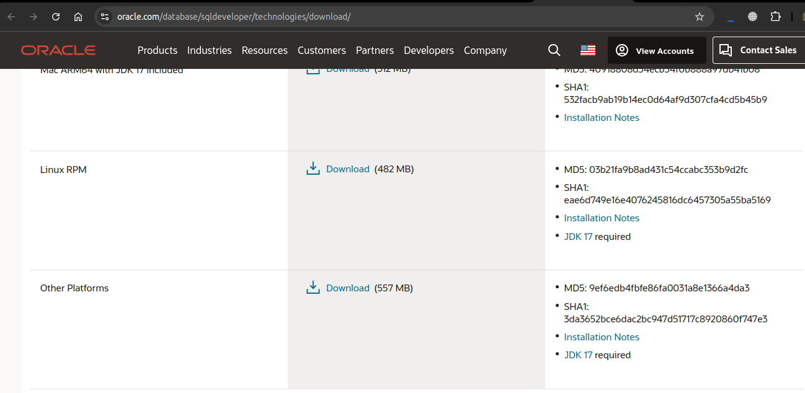

# How to install Oracle Developer on Linux Distributions

## Introduction
This document will guide you through the installation of Oracle Developer on Linux distributions. The installation process is the same for all Linux distributions. The only difference is the installation of the required packages, I will mention the required packages for each distribution. These above steps will help you to install Oracle Developer on your system, but if you don't want to follow these steps, can just exec the installOracle.sh script.

## Prerequisites
- Oracle Developer requires Java Development Kit (JDK) to be installed on your system. You can download the latest version of JDK from the [Oracle website](https://www.oracle.com/java/technologies/javase-jdk11-downloads.html).
- If you are using Ubuntu or Debian-based distributions, you can install:
    ```bash
        sudo apt update && sudo apt upgrade -y 
        sudo apt install openjdk-11-jdk
    ```
- If you are using Fedora or CentOS-based distributions, you can install:
    ```bash
        sudo dnf update -y
        sudo dnf install java-11-openjdk
    ```
- If you are using Arch-based distributions, you can install:
    ```bash
        sudo pacman -Syu
        sudo pacman -S jdk11-openjdk
    ```
- You can verify the installation of JDK by running the following command:
    ```bash
        java -version
    ```

## Installation
1. First, download the latest version of Oracle Developer from the [Oracle website](https://www.oracle.com/database/sqldeveloper/technologies/download/).
- Click on the "Other Platforms" download link.
- Accept the license agreement and download the "Oracle SQL Developer for other platforms" file.


2. Navigate to the directory where the downloaded file is located.
    ```bash
        cd ~/Downloads
    ```
3. Extract the downloaded file using the following command:
    ```bash
        unzip sqldeveloper-*-no-jre.zip
    ```
4. Move the extracted directory to the `/opt` directory:
    ```bash
        sudo mv sqldeveloper /opt
    ```
5. Change the permission of the file to make it executable:
    ```bash
        sudo chmod +x /opt/sqldeveloper/sqldeveloper.sh
    ```
6. Here, you can run the .sh script to start Oracle Developer:
    ```bash
        /opt/sqldeveloper/sqldeveloper.sh
    ```
    or 
    ```bash
        cd /opt/sqldeveloper/sqldeveloper
        sh sqldeveloper.sh
    ```

## Creating a shortcut for Oracle Developer
1. Create a desktop file for Oracle Developer:
    ```bash
        sudo vim /usr/share/applications/sqldeveloper.desktop
    ```
2. Add the following content to the file:
    ```bash
        [Desktop Entry]
        Name=Oracle SQL Developer
        Comment=Oracle SQL Developer
        Type=Application
        Categories=Development
        Exec=/opt/sqldeveloper/sqldeveloper.sh
        Terminal=false
        Icon=/opt/sqldeveloper/icon.png
    ```
3. Save the file and exit the editor.
4. Now, you can search for Oracle Developer in the application menu and launch it.

## How To use the installOracle.sh script
1. First, download the installOracle.sh script from the [GitHub repository]() to your system.
2. Make the script executable:
    ```bash
        chmod +x installOracle.sh
    ```
3. Run the script:
    ```bash
        ./installOracle.sh
    ```
4. The script will automatically download the latest version of Oracle Developer and install it on your system.

# Notes
This script and steps are based on the oracle site. If you have any issues, you can check the [Oracle website](https://www.oracle.com/database/sqldeveloper/technologies/download/).